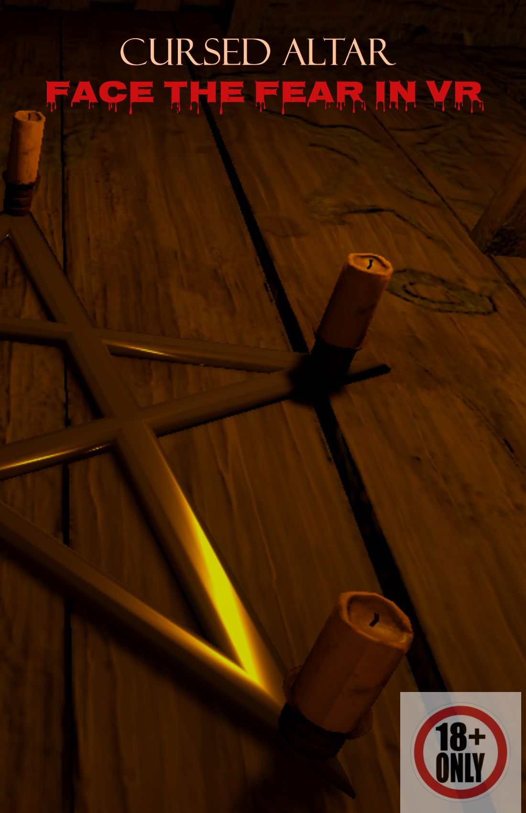

# Cursed Altar

*Some doors should never be opened.*



## Introduction

**Cursed Altar** is an immersive VR horror experience built for Meta Quest headsets that merges virtual terror with real world physical feedback. The player takes on the role of the last paranormal investigator sent to a cursed cabin in the woods, where every investigator before them has disappeared. Armed with nothing but a lantern, the player must navigate a pitch black cabin, uncover a demonic ritual, and confront a cursed skull that bridges the gap between the virtual and physical worlds.

The core problem this project addresses is the sensory disconnect in traditional VR horror. Most VR horror games rely solely on visual and audio stimuli delivered through the headset. While effective, this approach keeps the fear contained within the virtual space. Players can mentally "opt out" by reminding themselves that the experience is not real. **Cursed Altar** breaks this barrier by introducing tangible, physical feedback through an ESP32 microcontroller connected to an ultrasonic distance sensor and passive piezo buzzers hidden beneath a real table. When the curse activates in VR, the buzzers fire from an unexpected real world location directly beneath the player. This creates what researchers call a "break in presence," a real world sensory intrusion during VR immersion that amplifies emotional response and makes the horror feel like it has crossed into the player's physical space.

This approach is valuable because it demonstrates how low cost, accessible hardware (an ESP32 board, a distance sensor, and a few buzzers) can be combined with consumer VR headsets to create deeply unsettling experiences that go beyond what software alone can achieve. The bidirectional communication between the Quest headset and the ESP32 allows the physical world to influence the virtual experience (ultrasonic sensor detecting player proximity) and the virtual world to trigger physical events (buzzers firing on command), creating a truly blended reality horror experience.

## Design Process

### Inspiration

The creative vision for Cursed Altar was heavily inspired by the 2002 horror film **The Ring**, directed by Gore Verbinski. The film's iconic imagery of a cursed videotape, the unsettling "seven days" whisper, and the television scene where the boundary between media and reality dissolves became the foundational metaphors for this project. In The Ring, horror is not confined to a screen. It reaches through and touches the real world. This concept of horror that escapes its medium directly informed the decision to use physical hardware that fires real sound from beneath the player's table, making the curse feel as though it has broken free from the headset.

### Brainstorming and Ideation

The brainstorming process began with a central question: *How can a VR horror experience make the player feel that the curse is real?*

From this starting point, several key decisions emerged through iterative exploration:

**Setting and Atmosphere:** A small, enclosed cabin was chosen as the environment because tight spaces amplify claustrophobia in VR. The cabin's 2m × 2m interior was deliberately designed to match a typical Quest Guardian boundary, ensuring the player's physical play space and virtual space overlapped perfectly.

**Narrative Structure:** The gameplay was designed as a linear sequence of escalating supernatural events, each one more unsettling than the last. The progression moves from subtle (a door slamming, a stool sliding on its own) to overt (a skull appearing from thin air, a demonic ritual) to reality breaking (passthrough mixed reality, physical buzzers firing). This escalation mirrors classic horror film pacing.

**Interaction Design:** Each player interaction was designed to serve a dual purpose. The lantern is not just a light source; it is the player's only comfort in darkness, making its loss during the blackout phase deeply unsettling. The skull is not just an object to grab; it becomes the player's companion through a ritual they did not choose to participate in. The cross puzzle (a thumbstick sequence to invert the cross) was inspired by demonic imagery and gives the player a moment of agency before the horror escalates beyond their control.

**Physical Hardware Integration:** The decision to use an ESP32 with an ultrasonic sensor and buzzers was driven by a specific design goal: the player should experience something they cannot explain through VR alone. The ultrasonic sensor on the floor detects the player's legs, a body part the Quest headset cannot track, creating a sense that the cabin is truly aware of their presence. The buzzers, hidden beneath a real table, fire an eerie tone from below, an unexpected physical location that conflicts with the VR soundscape and creates spatial audio disorientation.

### User Experience Flow

The experience was carefully choreographed to build tension through a series of phases:

1. **Discovery:** The player finds and picks up a lantern, their only light source
2. **Entrapment:** The door slams shut, a stool slides on its own. Something is in the cabin
3. **Investigation:** A cabinet falls open, a cross puzzle demands the player's attention
4. **Ritual:** A cursed skull appears on an altar surrounded by a pentagram
5. **Confrontation:** A stare contest with the skull that builds through vibration and glowing light
6. **Terror:** Total darkness, a frozen hanging girl, and a chaos phase that erupts all at once
7. **Transcendence:** A cursed video plays (inspired by The Ring), then the VR world dissolves into passthrough mixed reality, and physical buzzers fire from the real world beneath the table
8. **The Curse:** The whisper "seven days" plays as the game ends, leaving the player in passthrough, staring at their real surroundings, wondering if the curse followed them out

## System Description

### Features

**Immersive Horror Environment**
- A detailed wooden cabin interior with furniture, horror props, a pentagram, and a hanging figure
- Dynamic lighting through a handheld lantern with realistic flickering effects
- Complete darkness as a gameplay mechanic, where the player's only light can be taken away

**Scripted Scare Sequences**
- A self slamming door with rattling and lock sounds
- A poltergeist stool that slides across the floor when the player gazes at it
- A rocking chair that rocks on its own and stops when observed
- A cabinet that falls onto the table when triggered by the player's ray cast

**Interactive Ritual Mechanics**
- A cross puzzle requiring a specific thumbstick sequence (Up, Left, Down, Right, Up) to invert the cross
- Five pentagram candles that light up as the player brings the cursed skull close to each one
- A stare contest where gazing at the skull causes it to glow red with escalating controller vibrations

**Jump Scares and Chaos Phase**
- Church bell sound with lantern flash when the cross inverts
- Instant darkness at 80% skull glow, with a frozen hanging girl repositioned at the pentagram center
- A 12 second chaos phase with all lights, sounds, rocking chair, door rattling, and pentagram candles erupting simultaneously

**Mixed Reality Transition**
- After the chaos, a blackout fades into a Ring inspired cursed video
- The VR world dissolves into Meta Quest passthrough mode, revealing the player's real surroundings
- The boundary between virtual horror and physical reality is erased

**ESP32 Physical Feedback System**
- HC SR04 ultrasonic sensor detects the player's real world leg proximity to the altar
- Four passive piezo buzzers fire a staggered cryptic ringtone from beneath the table
- Bidirectional Wi Fi communication: physical sensor data drives VR events, VR events trigger physical buzzers
- The "seven days" whisper plays after the buzzers stop, ending the experience

**Contextual Hint System**
- Audio and text hints guide the player when they are stuck (lantern grab hint, cabinet hint, cross thumbstick hint, "come closer" whisper)
- All hints are gaze based or time based and disappear once the player performs the correct action

### Demo Video

Watch the full gameplay walkthrough:

[Cursed Altar Demo Video](https://drive.google.com/file/d/1z6Abozns0sWABsA9U_M8JeqWN6rOY011/view?usp=drive_link)


## Installation

### Requirements

| Platform | Device | Requirements |
| -------- | ------ | ------------ |
| Android (Quest) | Meta Quest 2, 3, 3S, or Pro | Unity 6 with Android Build Support, Meta XR SDK v85, URP |
| ESP32 | ESP32 S2 Thing Plus | Arduino IDE with ESP32 board support |

### Setup Steps

**Unity Project:**

1. Clone the repository:
   ```
   git clone https://github.com/sakib13/CursedAltar.git
   ```
2. Open the project in Unity 6 (or later) with Universal Render Pipeline
3. Ensure Meta XR SDK v85 is installed via the Package Manager
4. Open `Assets/Scenes/SampleScene.unity`
5. Connect your Meta Quest headset via USB or set up wireless ADB
6. Go to File > Build Settings > Switch Platform to Android
7. Click Build and Run

**ESP32 Hardware:**

1. Install Arduino IDE and add ESP32 board support
2. Open `ESP32/CursedAltar_ESP32/CursedAltar_ESP32.ino`
3. Update the Wi Fi credentials in the sketch
4. Upload to the ESP32 S2 Thing Plus
5. Note the IP address from the Serial Monitor
6. Power the ESP32 from a USB power bank for wireless operation

**Wiring Diagram:**

```
ESP32 S2 Thing Plus       HC SR04              4× Passive Buzzers
─────────────────         ──────               ──────────────────
5V (USB pin) ────────────→ VCC
GND ─────────────────────→ GND ──────────────→ Negative (all)
GPIO 4 ──────────────────→ TRIG
GPIO 5 ←── [1K0 res] ←─── ECHO
              │
          [2K2 res]
              │
             GND

GPIO 6, 7, 8, 9 ────────────────────────────→ Positive (one each)
```

### Dependencies

- **Unity 6** with Universal Render Pipeline (URP)
- **Meta XR SDK v85** for Quest headset support and Building Blocks
- **TextMeshPro** (included with Unity) for in game hint text
- **Arduino IDE** with ESP32 board package by Espressif Systems

## Usage

### Controls

| Action | Controller | Input |
| ------ | ---------- | ----- |
| Pick up lantern | Right controller | Right trigger (near lantern) |
| Open cabinet | Right or left controller | Point and pull trigger |
| Cross ritual | Left controller | Thumbstick (Up, Left, Down, Right, Up) |
| Build up candle | Right controller | Hold B button |
| Grab skull | Right or left controller | Trigger (near skull) |
| Move around | Left controller | Thumbstick (after lantern pickup, locomotion is locked) |

### Gameplay Tips

- The lantern is your only light source. Once you pick it up, it stays in your hand for the entire experience. Pay attention to how it reacts to your surroundings
- When you hear whispers, follow them. The cabin is trying to tell you something
- The cross on the wall requires a specific directional sequence on the thumbstick. Listen for audio cues and watch for the red glow that confirms each correct input
- After placing the skull on the table, do not look away. The curse responds to your gaze
- When the room goes dark, stay calm. Look around slowly. Something is watching you
- In the final phase, you will see the real world through your headset. The experience is not over

### Physical Setup (Demo Day)

```
┌────────────────────────────┐
│                            │
│  ┌──────────────────────┐  │
│  │  Table               │  │
│  │  (ESP32 + buzzers    │  │
│  │   hidden underneath) │  │
│  └──────────────────────┘  │
│                            │
│  [Ultrasonic on floor,     │
│   pointing toward player]  │
│                            │
│         ~2m walk           │
│                            │
│       ┌──────────┐         │
│       │  Player  │         │
│       │  starts  │         │
│       │  here    │         │
│       └──────────┘         │
│    (tape mark on floor)    │
│                            │
└────────────────────────────┘
         ~ 2m × 2m area
```

- Place the ESP32 breadboard and buzzers under a real table, hidden from view
- Tape the ultrasonic sensor to the floor near the table, pointing outward toward the player's starting position
- Both the Quest headset and ESP32 must be on the same Wi Fi network (phone hotspot recommended for portability)
- Mark the play area (~2m × 2m) and starting position with tape on the floor

## References

### Primary Inspiration

- **The Ring** (2002), directed by Gore Verbinski. The film's concept of a curse that crosses the boundary between media and reality directly inspired the physical feedback system and the passthrough mixed reality ending

### Scientific Research

- Haptic Feedback as Affective Amplifier in VR (2025). Frontiers in Psychology. https://www.frontiersin.org/journals/psychology/articles/10.3389/fpsyg.2025.1560157/full
- Breaking Presence in Immersive VR (2024). Computer Methods and Programs in Biomedicine. https://www.sciencedirect.com/science/article/pii/S0169260724001202
- Fear and Loathing in VR: Emotional and Physiological Effects of Immersive Horror Games (2021). Virtual Reality. https://link.springer.com/article/10.1007/s10055-021-00555-w
- Haptic vs Visual Feedback on Presence in VR (2021). Computers in Human Behavior. https://www.sciencedirect.com/science/article/pii/S107158192100135X
- Haptic Feedback in Virtual Crowd Scenario (2023). Frontiers in Virtual Reality. https://www.frontiersin.org/journals/virtual-reality/articles/10.3389/frvir.2023.1242587/full
- Decoding Fear: User Experiences in VR Horror Games (2023). arXiv. https://arxiv.org/html/2312.15582v1

### Assets and Tools

- **Cabin Environment Pack** (Unity Asset Store) for the base cabin, furniture, and props
- **Sketchfab** for additional 3D models including pentagram, hanging girl, rope, ouija board, polaroid pictures, and paintings
- **Zdzisław Beksiński** painting reproduction (Sketchfab) used as wall decoration to enhance the surreal horror atmosphere
- **Freesound.org** and other free audio sources for sound effects including door slams, whispers, heartbeats, church bells, and ambient horror drones
- **Meta XR SDK v85** and Building Blocks for Meta Quest integration
- **Vefects Free Fire VFX URP** for candle flame particle effects
- **SparkFun ESP32 S2 Thing Plus** with HC SR04 ultrasonic sensor and passive piezo buzzers for physical feedback hardware

## Contributors

**Sakib Ahsan Dipto**
MSc Programme in Design for Creative and Immersive Technology
Stockholm University

GitHub: [github.com/sakib13](https://github.com/sakib13)
